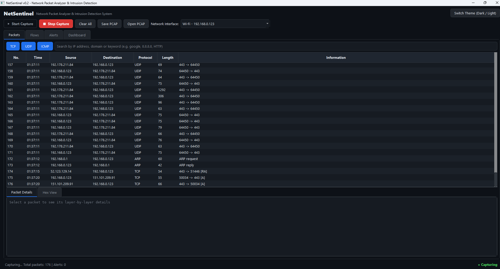
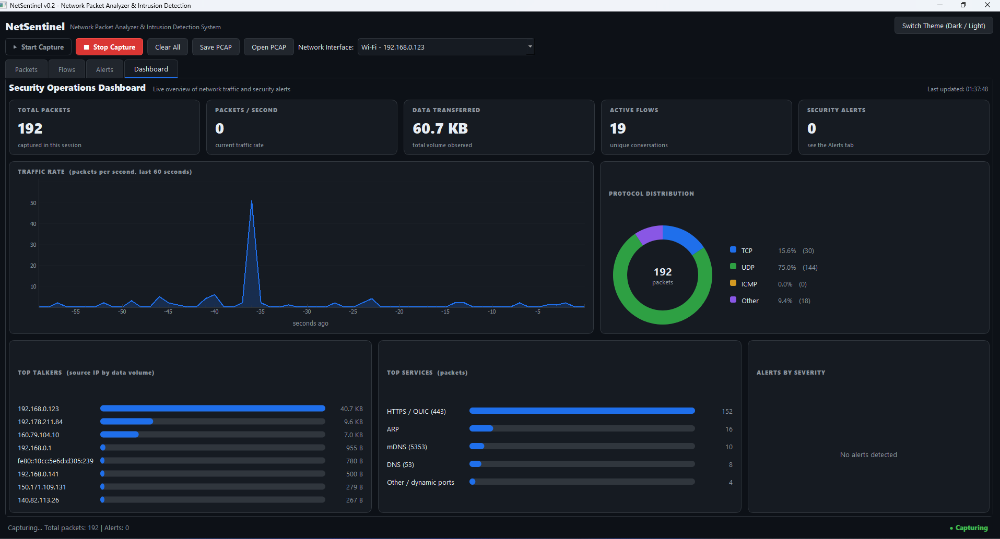
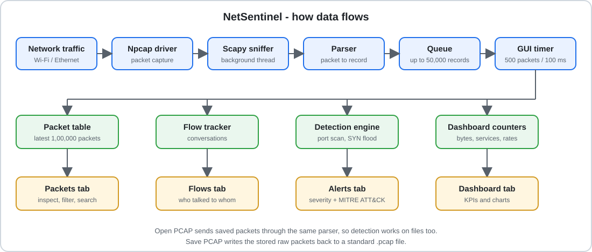

# NetSentinel

**Network Packet Analyzer & Intrusion Detection System** built in Python for SOC (Security Operations Center) learning and portfolio use.

NetSentinel captures live network traffic, breaks it into packets and conversations (flows), detects suspicious behaviour such as port scans and SYN floods, maps every alert to the **MITRE ATT&CK** framework, and shows everything on a management-style dashboard.

> Built from scratch as a rebuilt and much-improved version of a college packet sniffer project. Current version: **v0.2**

---

## Screenshots

**Live packet capture** - numbered packets, protocol filters, search, and a layer-by-layer packet view



**Security Operations Dashboard** - KPIs, traffic rate, protocol mix, top talkers, top services and alerts by severity



---

## Features (v0.2)

| Area | What it does |
|---|---|
| **Live capture** | Captures packets from any network interface (Wi-Fi / Ethernet) with Start / Stop buttons |
| **Packet table** | Numbered packets with time, source, destination, protocol, length and information. Handles up to **1,00,000 packets** smoothly |
| **Protocol decoding** | TCP, UDP, ICMP, ARP, plus DNS queries and HTTP request metadata |
| **Packet inspection** | Click any packet for a layer-by-layer breakdown and a hex / ASCII view |
| **Filters and search** | Protocol toggle buttons and a search box (IP, domain, keyword) |
| **Flow tracking** | Groups packets into conversations (who talked to whom, how many packets, how many bytes, how long) |
| **PCAP support** | Save captures and open existing `.pcap` / `.pcapng` files (compatible with Wireshark). Detection also runs on opened files |
| **Threat detection** | Port Scan and SYN Flood detection with severity, MITRE ATT&CK ID and a recommended action |
| **Dashboard** | KPI cards, live traffic-rate graph, protocol distribution, top talkers, top services, alerts by severity |
| **Themes** | Professional dark and light themes |

## Detections

| Detection | How it works | MITRE ATT&CK |
|---|---|---|
| **Port Scan** | One source sends SYN packets to 15 or more different ports within 10 seconds | T1046 - Network Service Discovery |
| **SYN Flood** | One source sends 100 or more SYN packets within 5 seconds | T1498 - Network Denial of Service |

Each detection can be switched ON or OFF from the Alerts tab. Alerts are rate-limited (30 second cool-down per source) to avoid alert spam.

## Architecture



Capture runs in a background thread and the interface pulls packets in small batches, so the window stays smooth even on heavy traffic such as video streaming.

| File | Role |
|---|---|
| `main.py` | Main window, buttons, tabs, packet table and theme |
| `sniffer.py` | Live capture thread, packet parser (DNS / HTTP decoding), fast PCAP writer |
| `detector.py` | Detection rules (Port Scan, SYN Flood) |
| `flows.py` | Flow (conversation) tracking |
| `dashboard.py` | Dashboard tab, KPI cards and charts |

A complete explanation of every button and what happens behind it is in [`docs/BUTTON_FLOW.md`](docs/BUTTON_FLOW.md).

## Installation

**Requirements:** Python 3.10 or newer.

1. **Windows only:** install [Npcap](https://npcap.com) and tick *"Install Npcap in WinPcap API-compatible Mode"*. On Linux / macOS libpcap is already available.
2. Install the Python libraries:
   ```
   pip install -r requirements.txt
   ```
3. Run with administrator / root rights (needed for packet capture):
   ```
   python main.py            # Windows: run the terminal as Administrator
   sudo python3 main.py      # Linux / macOS
   ```

## Usage

1. Choose your active network interface (for example *Wi-Fi - 192.168.x.x*).
2. Press **Start Capture** and browse any website.
3. Click a packet to inspect it, open the **Flows** tab for conversations, and the **Dashboard** tab for the overview.
4. Press **Stop Capture** and **Save PCAP** to keep the capture.

## Testing the detections (own lab only)

Use two machines or virtual machines that **you own**, for example a Kali Linux VM and your host:

```
nmap -sS <IP of your own lab machine>
```

Within a few seconds a **Port Scan** alert should appear in the Alerts tab. You can also open any existing PCAP file that contains a scan to see the same alert.

## Roadmap

- [x] v0.1 - live capture, packet table, basic detections
- [x] v0.2 - PCAP open / save, flows, DNS / HTTP decoding, hex view, professional UI and dashboard
- [ ] v0.3 - host scan, brute-force and non-standard port detection, YAML rule engine, auto-save PCAP
- [ ] v0.4 - beaconing (C2) and DNS tunneling detection, IOC / threat-intelligence check, risk scoring
- [ ] v0.5 - alert triage (true / false positive), incident timeline, incident report generator

## Limitations

- Detection thresholds are fixed in code for now (they will move to a rules file in v0.3).
- Only the latest 1,00,000 packets are kept in memory. Use **Save PCAP** to keep a capture.
- TLS traffic is shown as encrypted; only metadata (addresses, ports, sizes) is visible.

## Legal and ethical use

Only capture traffic on networks you own or are explicitly authorised to monitor. Capturing other people's traffic without permission is illegal.

## Use it for learning

NetSentinel is open source under the MIT License. Students are welcome to study it, run it in their own lab and extend it as a learning or college project. If you reuse it, please read `docs/BUTTON_FLOW.md` first so you can explain how every part works, and give credit by linking back to this repository.
