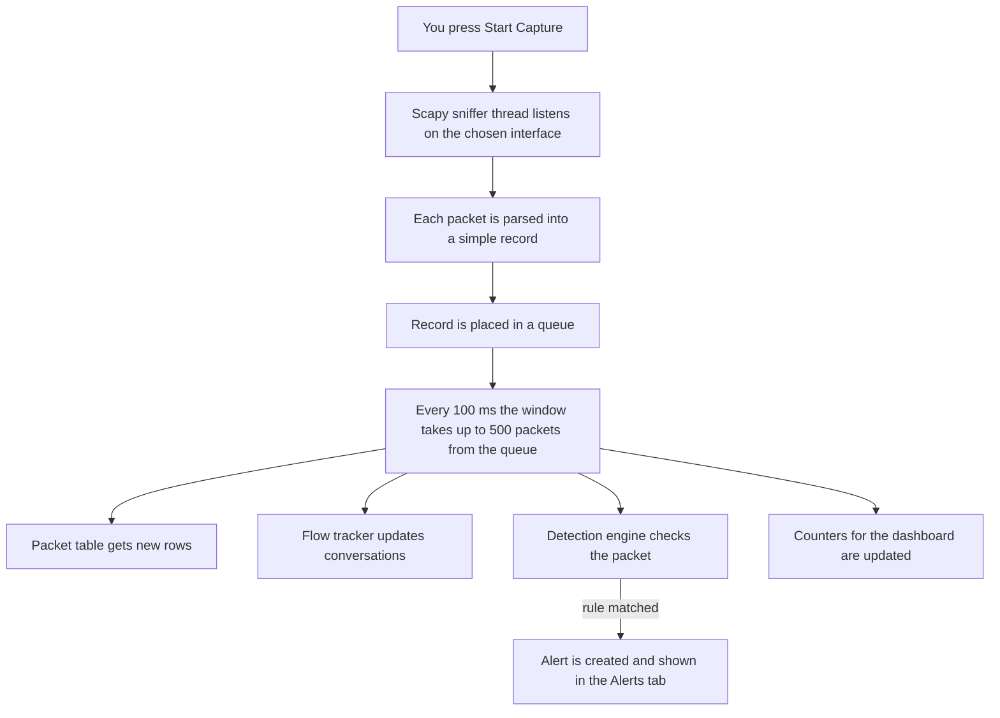
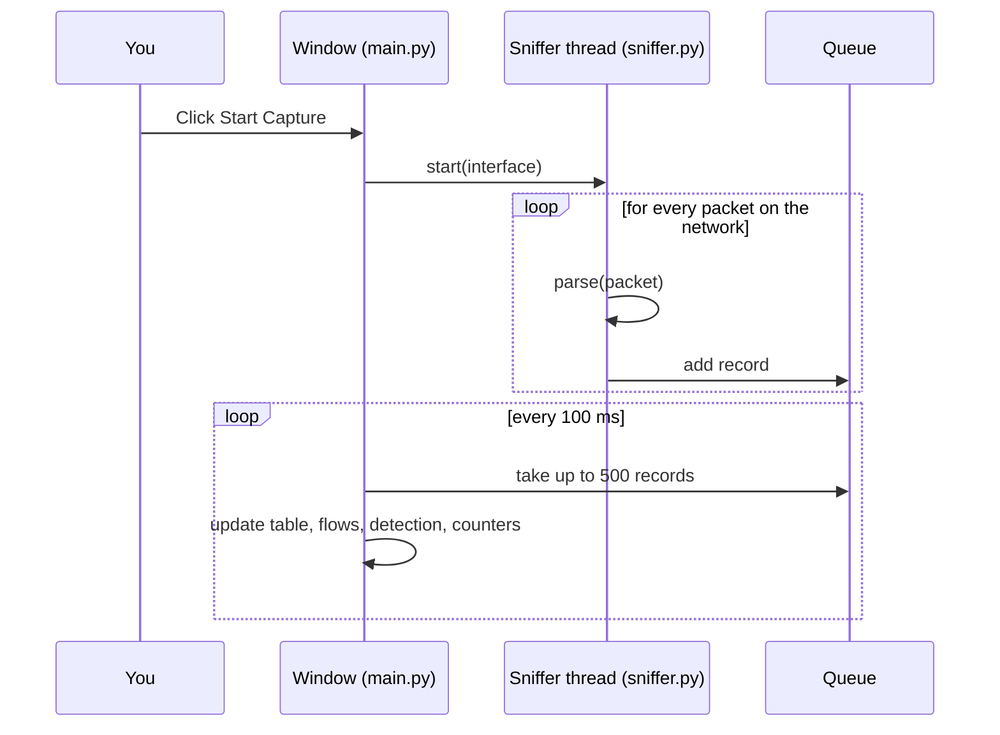
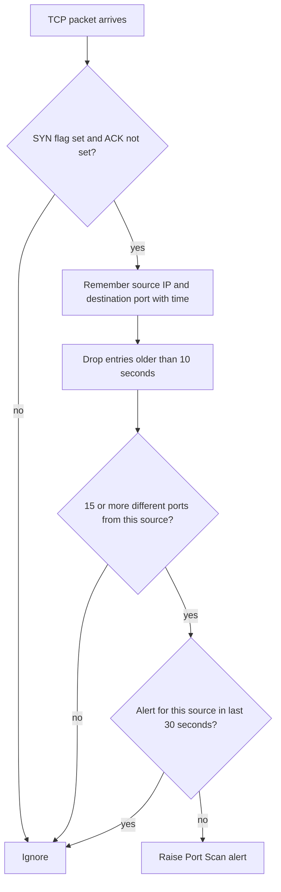

# NetSentinel - Button Flow Guide

This guide explains **every button and tab** in NetSentinel: what you do, what happens inside the program, what you see, and why it matters for a SOC analyst. Read it top to bottom once and you will be able to explain the whole project.

---

## 1. The big picture

**Why a queue?** A video stream can send thousands of packets per second. If the window tried to redraw for every single packet it would freeze. The capture thread only drops packets in a queue, and the window drains the queue in batches. This is why NetSentinel stays smooth.

## 2. Key words

| Term | Simple meaning |
|---|---|
| **Packet** | One small piece of data travelling on the network |
| **Flow** | A conversation: all packets between the same two endpoints (IP + port) using the same protocol, in both directions |
| **PCAP** | A file format that stores captured packets (Wireshark can open it too) |
| **NIDS** | Network Intrusion Detection System: watches traffic and raises alerts |
| **Alert** | A warning created when traffic matches a detection rule |
| **MITRE ATT&CK** | A public catalogue of attacker techniques. Each technique has an ID such as T1046 |
| **SYN** | The first packet of a TCP connection ("can we talk?") |
| **QUIC** | The UDP-based protocol YouTube and Google use. This is why UDP is high during video playback |

## 3. Files and their jobs

| File | Job |
|---|---|
| `main.py` | Window, buttons, tabs, packet table, themes, the timers that move data around |
| `sniffer.py` | Capture thread, packet parser (DNS and HTTP decoding), PCAP writer |
| `detector.py` | The detection rules |
| `flows.py` | Builds conversations from packets |
| `dashboard.py` | Dashboard tab: KPI cards and charts |

---

## 4. Top toolbar

### Start Capture
| | |
|---|---|
| **You do** | Choose a network interface, press Start Capture |
| **Inside** | `start()` creates a Scapy `AsyncSniffer` for that interface and starts it in a background thread. For every packet the thread runs `parse()` and puts the result in the queue |
| **Buttons change** | Start Capture turns grey, Stop Capture turns red and active, the interface list is locked |
| **You see** | State shows **Capturing** (green) and the packet table starts filling |
| **If nothing arrives** | After 5 seconds the status bar says to try another interface (the wrong adapter is the most common reason) |

### Stop Capture
| | |
|---|---|
| **Inside** | `stop()` stops the sniffer thread and empties what is left in the queue into the table |
| **You see** | State changes to **Stopped** (red) and the final packet and alert totals appear in the status bar. Start Capture becomes active again |
| **Note** | Packets stay on screen so you can still inspect them |

### Clear All
| | |
|---|---|
| **Inside** | Empties the queue and the packet table, and resets packet numbering, flows, dashboard counters, top talkers and services |
| **Does not clear** | Alerts (they have their own Clear Alerts button) |
| **Why** | Start a fresh investigation without restarting the program |

### Save PCAP
| | |
|---|---|
| **Inside** | `write_pcap()` writes every stored packet (raw bytes plus timestamp) into a standard `.pcap` file. It writes bytes directly, so even 1,00,000 packets save almost instantly |
| **You see** | A file dialog, then the status bar shows how many packets were saved |
| **Why it matters** | The capture becomes evidence you can open later in NetSentinel or Wireshark |

### Open PCAP
| | |
|---|---|
| **Inside** | Reads the file, clears the current data, resets the detector, then pushes the packets through the same pipeline as live traffic. **Detection runs on the file too**, using each packet's original timestamp |
| **Limit** | The first 1,00,000 packets are loaded; the status bar tells you if the file was larger |
| **Why it matters** | This is the core SOC skill: investigate a capture after an incident |

### Network Interface (dropdown)
Lists your adapters with friendly names and IP addresses (for example *Wi-Fi - 192.168.1.5*), active ones first. The adapter that carries your internet traffic is selected by default. It is locked while capturing.

### Switch Theme (Dark / Light)
Swaps the colour set and re-applies the style sheet to the whole window and the dashboard. Nothing else changes.

---

## 5. Packets tab

### Table columns
**No.** (running packet number) - **Time** - **Source** - **Destination** - **Protocol** - **Length** (bytes) - **Information** (ports and TCP flags, DNS query name, HTTP request line and Host).

The table holds the latest 1,00,000 packets. It auto-scrolls only while you are at the bottom, so scrolling up to read something will not be interrupted.

### TCP / UDP / ICMP buttons
| | |
|---|---|
| **Inside** | Each button is a toggle (blue = shown, grey = hidden). The table asks a filter model to re-check every row |
| **You see** | Rows of the hidden protocol disappear instantly. They are not deleted, so toggling back brings them back |

### Search box
Type an IP, a domain, a protocol or any word from the Information column (for example `google`, `8.8.8.8`, `HTTP`). Matching rows stay, the rest are hidden. It works together with the protocol buttons. Typical use: type `dns` to see every domain lookup.

### Clicking a packet (Packet Details and Hex View)
| | |
|---|---|
| **Inside** | Only raw bytes are stored per packet (to save memory). When you click, the full packet is rebuilt from those bytes |
| **Packet Details tab** | Layer-by-layer view: Ethernet, IP, TCP / UDP and so on, with every field |
| **Hex View tab** | The same packet as hexadecimal bytes with the ASCII text beside them |
| **Why it matters** | This is how an analyst proves what a packet really contained |

---

## 6. Flows tab

| Column | Meaning |
|---|---|
| Protocol | TCP / UDP / ICMP |
| Endpoint A / B | IP address and port of each side |
| Application | DNS or HTTP when recognised |
| Packets / Bytes | How much was exchanged |
| Duration | Time between the first and the last packet |

**Inside:** each packet gets a key made from the protocol and the two endpoints, sorted so both directions land in the same flow. The tab refreshes every second and shows the 200 most recently active flows (up to 1,00,000 are tracked).

**Why it matters:** thousands of packets become a few readable lines. Analysts think in conversations, not packets. A YouTube video of 10,000 packets is just a handful of flows.

---

## 7. Alerts tab

### Port Scan Detection: ON / OFF  and  SYN Flood Detection: ON / OFF
Switches that enable or disable each rule. ON = blue, OFF = grey. Useful for testing a single rule or reducing noise.

### Alert Details
Select an alert row, press the button, and a window shows: severity, MITRE ATT&CK ID, what was observed, and a **recommended action**. This is the "what do I do next" step of triage.

### Clear Alerts
Removes all alerts from the list (the packets stay).

### Alert table columns
Time - Severity - Attack Name - Source IP Address - MITRE ATT&CK ID.

---

## 8. Detection rules explained

### Port Scan  (MITRE T1046, severity Medium)

**Idea:** a normal user connects to a few ports. An attacker mapping your network knocks on many different ports quickly.

### SYN Flood  (MITRE T1498, severity High)
**Idea:** a source sends 100 or more SYN packets (connection requests with no follow-up) within 5 seconds. A server can run out of resources answering them, so it is a denial-of-service pattern.

### Why a 30-second cool-down?
Without it, one scan would raise hundreds of identical alerts. Real SOCs call this alert fatigue.

### Known limits (good to mention honestly)
- Fixed thresholds can cause false positives (for example a vulnerability scanner you run yourself) and false negatives (a very slow scan). Moving thresholds into a rules file is planned for v0.3.

---

## 9. Dashboard tab

| Widget | What it shows | How it is calculated |
|---|---|---|
| **Total Packets** | Packets seen in this session | Counter, never reduced by the table limit |
| **Packets / Second** | Current traffic rate | Difference of the total between two 1-second ticks |
| **Data Transferred** | Total volume | Sum of packet lengths |
| **Active Flows** | Unique conversations | Number of tracked flows |
| **Security Alerts** | Alerts raised (red when above 0) | Length of the alert list |
| **Traffic Rate graph** | Packets per second for the last 60 seconds | History of the per-second values |
| **Protocol Distribution** | TCP / UDP / ICMP / Other share | Counters per protocol |
| **Top Talkers** | Source IPs sending the most data | Bytes summed per source IP |
| **Top Services** | Busiest services (HTTPS, DNS, SSH, RDP...) | Port number mapped to a service name |
| **Alerts by Severity** | High / Medium / Low counts | Counted from the alert list |

The dashboard refreshes every second while its tab is open.

---

## 10. Background timers (nothing to click)

| Timer | Interval | Job |
|---|---|---|
| Drain timer | 100 ms | Moves up to 500 packets from the queue into the table, flows, detection and counters |
| Tick timer | 1 second | Records packets per second, refreshes Flows or Dashboard if open, shows the "no packets" hint |

---

## 11. One full example

1. Select *Wi-Fi - 192.168.x.x* and press **Start Capture**. State: Capturing.
2. Open a YouTube video. Packets scroll in, many UDP rows on port 443 (QUIC).
3. Type `dns` in search: you see the domain lookups the page made.
4. Open **Flows**: thousands of packets are now a few long conversations with Google servers.
5. Open **Dashboard**: UDP dominates the donut, HTTPS / QUIC is the top service, your laptop is the top talker.
6. In your own lab, run `nmap -sS <lab machine IP>`: a **Port Scan** alert appears. Select it and press **Alert Details** to read the MITRE ID and the recommended action.
7. Press **Stop Capture** and then **Save PCAP** to keep the evidence.

---

## 12. Interview talking points

**30-second pitch**
"I built NetSentinel, a network intrusion detection tool in Python. It captures live traffic, groups packets into flows, detects port scans and SYN floods, maps alerts to MITRE ATT&CK and presents everything on a SOC dashboard. I also made it open PCAP files so I can investigate captures after an incident."

**Questions you may get**

| Question | Short answer |
|---|---|
| Why a queue and batching? | Capture can be thousands of packets per second. The capture thread only queues, and the interface takes batches, so the window never freezes |
| What is a flow and why track it? | A conversation between two endpoints. Analysts work with conversations, not single packets |
| How does port scan detection work? | Count distinct destination ports probed with SYN packets by one source in a 10-second window; 15 or more raises an alert |
| How do you reduce false positives? | Cool-down per source, ON / OFF per rule, thresholds that will be configurable in a rules file |
| Why store raw bytes instead of packet objects? | Memory. It lets the table hold 1,00,000 packets in a few hundred MB; the full packet is rebuilt only when you click it |
| Can it see inside HTTPS? | No. Content is encrypted. It still sees metadata: addresses, ports, sizes, timing |
| What would you add next? | Beaconing and DNS tunneling detection, threat-intelligence lookups, risk scoring, incident reports |
